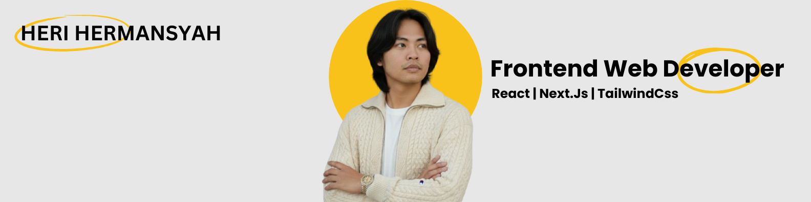

# **Hi, I'm Heri Hermansyah** 👋 

# **Frontend Web Developer**  

Frontend Developer specializing in modern JavaScript frameworks and responsive UI design. Skilled in React, TailwindCSS, and deployment workflows with Vercel. Focused on building user-friendly applications with clean, maintainable code.

## 🌐 Socials:

# Skills:

     

# Creative:

   

# Tools:

# 📊 GitHub Stats:

 
 

### 🔝 Top Contributed Repo

---

<!-- Proudly created with GPRM ( https://gprm.itsvg.in ) -->
